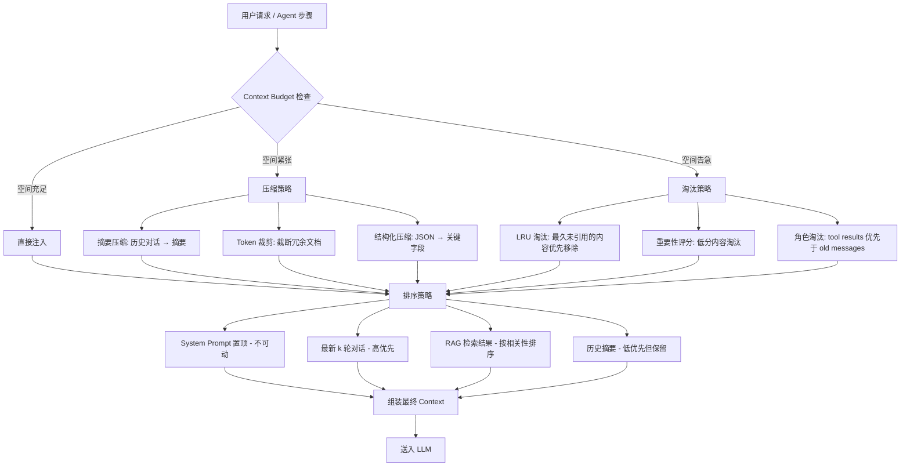

import Image from 'next/image'

# Module 1: Context Engineering（上下文工程）

> **核心比喻：** 工作台 — 你的桌面空间有限，必须战略性地摆放最重要的资料。

## 这章在解决什么问题？

当 Agent 不再是一次性问答，而是持续多轮工作时，你不能只想“prompt 怎么写”，而要想“每一轮到底给模型看到什么，删掉什么，保留什么”。这一章把这个问题从经验活变成工程问题。

## 读这一章时，先盯住三件事

- 为什么 context 质量，往往比模型型号更直接决定结果
- 压缩、淘汰、排序三件事分别在什么时机发生
- 为什么进阶 RAG 的本质是组装 context，而不是“接一个向量库”

## 学完后你应该能做什么

- 为 Agent 设计明确的 context budget 和装配顺序
- 解释 HyDE、Reranking、Metadata Filtering 各自解决什么检索问题
- 快速判断一个 Agent 是“模型不行”还是“喂给模型的 context 不对”

## 从 Prompt Engineering 到 Context Engineering

2023 年，我们写 prompt。2025 年，我们工程化 context。

区别不在措辞——在于**规模与系统性**。Prompt Engineering 关注的是「怎么问」；Context Engineering 关注的是「在问之前，桌面上已经摆了什么」。

想象你是一个律师，准备出庭辩护。Prompt Engineering 是你在法庭上如何提问的技巧。Context Engineering 是你在出庭前**花三周整理卷宗**的过程——哪些证据放在手边，哪些归档备查，哪些直接排除。

这个转变的根本驱动力：

1. **模型能力饱和**：GPT-4 到 Claude Opus 4 的差距，远小于「喂对 context」和「喂错 context」的差距
2. **Agent 架构崛起**：Agent 不是单次问答，而是多轮交互。每一轮都要决定桌面上放什么
3. **窗口变大但不够大**：128K-1M tokens 看似巨大，但 Agent 跑 20 轮就烧完了

## Context Window：你的工作台

把 context window 想象成一张固定大小的工作台。

- **桌面面积** = token 上限（128K / 200K / 1M）
- **摆在桌上的资料** = system prompt + 历史对话 + 检索文档 + 工具调用结果
- **桌面空间告急** = 模型开始丢失早期上下文，产出质量暴跌

关键洞察：**不是桌面越大越好，而是桌面上的信号噪比决定一切。**

一个 128K 窗口里塞满精准信息，远胜于 1M 窗口里堆满无关文档。

<Image
  src="/course-visuals/module-1/01-context-budget-control-board.svg"
  alt="Context budget 控制板，展示 system prompt、recent chat、RAG docs 和 history summary 如何在有限 token 预算内组装最终上下文。"
  width={1600}
  height={900}
/>

*先把 context 看成预算分配板，再看后面的压缩和淘汰策略，会更容易建立工程直觉。*

### 三大策略：压缩、淘汰、排序

<Image
  src="/course-visuals/module-1/02-context-strategy-control-board.png"
  alt="压缩、淘汰、排序三种上下文策略对照图，比较它们的触发条件、动作和结果。"
  width={1920}
  height={1080}
/>



### 策略一：压缩（Compression）

桌上资料太多？把厚文件压缩成摘要卡片。

```python
from openai import OpenAI

client = OpenAI()

def compress_conversation(messages: list[dict], max_pairs: int = 5) -> list[dict]:
    """当对话超过阈值时，将早期对话压缩为摘要"""
    if len(messages) <= max_pairs * 2:
        return messages

    # 保留 system prompt
    system = [m for m in messages if m["role"] == "system"]
    # 需要压缩的早期对话
    old_messages = [m for m in messages if m["role"] != "system"][:-max_pairs * 2]
    # 保留的最近对话
    recent = [m for m in messages if m["role"] != "system"][-max_pairs * 2:]

    # 用 LLM 生成摘要
    summary_prompt = (
        "将以下对话历史压缩为简洁摘要，保留所有关键决策和事实：\n\n"
        + "\n".join(f'{m["role"]}: {m["content"]}' for m in old_messages)
    )
    summary = client.chat.completions.create(
        model="gpt-4o-mini",
        messages=[{"role": "user", "content": summary_prompt}],
        max_tokens=500,
    ).choices[0].message.content

    return system + [{"role": "system", "content": f"[历史摘要] {summary}"}] + recent
```

**关键决策**：用哪个模型做压缩？不要用主模型——成本太高。用 `gpt-4o-mini` 或 `claude-haiku` 做摘要，主模型做推理。这是工作台的「助理整理员」。

### 策略二：淘汰（Eviction）

桌面满了，必须把一些资料收进抽屉。问题是：扔哪些？

```python
from dataclasses import dataclass
from typing import Literal

@dataclass
class ContextBlock:
    content: str
    token_count: int
    block_type: Literal["system", "user", "assistant", "tool_result", "rag_doc", "summary"]
    relevance_score: float  # 0.0-1.0
    last_referenced_step: int  # Agent 最后引用此块的步骤编号

# 淘汰优先级（分数越低越先淘汰）
PRIORITY_WEIGHTS = {
    "system": 100,      # 永不淘汰
    "user": 5,          # 最近的用户消息权重高
    "assistant": 3,     # 模型回复可压缩
    "tool_result": 2,   # 工具结果：用完即可降级
    "rag_doc": 1,       # RAG 文档：最容易被替换
    "summary": 8,       # 摘要：信息密度高，保留
}

def evict(blocks: list[ContextBlock], budget: int, current_step: int) -> list[ContextBlock]:
    """在 token 预算内保留最高价值的 context blocks"""
    for b in blocks:
        recency = 1.0 / (1 + current_step - b.last_referenced_step)
        b._priority = (
            PRIORITY_WEIGHTS[b.block_type] * 0.4
            + b.relevance_score * 0.4
            + recency * 0.2
        )

    # 按优先级降序排列
    blocks.sort(key=lambda b: b._priority, reverse=True)

    kept, total = [], 0
    for b in blocks:
        if total + b.token_count <= budget:
            kept.append(b)
            total += b.token_count
    return kept
```

### 策略三：排序（Prioritization）

LLM 对上下文中的位置敏感。经典研究 *Lost in the Middle*（Liu et al., 2023）表明：模型更关注开头和结尾的内容，中间部分容易被忽略。

排序原则：

| 位置 | 放什么 | 原因 |
|------|--------|------|
| **最前** | System prompt + 角色定义 | 锚定行为模式 |
| **前段** | 当前任务的 RAG 文档 | 最需要被精确引用 |
| **中段** | 历史摘要 | 提供背景但不关键 |
| **最后** | 最近 2-3 轮对话 + 当前用户输入 | Recency bias 为你所用 |

## RAG 进阶模式

基础 RAG（检索 → 拼接 → 生成）在 2024 年就不够用了。以下是三个你需要掌握的进阶模式。

<Image
  src="/course-visuals/module-1/03-advanced-rag-assembly-pipeline.svg"
  alt="高级 RAG 装配流程图，展示 Query 如何经过 HyDE、Metadata Filtering、向量检索和 Reranking，最终组装成 Final Context。"
  width={1600}
  height={900}
/>

### HyDE：Hypothetical Document Embeddings

问题：用户的 query 和文档之间存在**语义鸿沟**。用户问「怎么处理高并发」，但文档写的是「基于 asyncio 的事件循环架构」。

HyDE 的思路：先让 LLM **凭空生成一个假想答案**，用这个假想答案去做 embedding 检索。假想答案和真实文档在语义空间中更接近。

```python
from llama_index.core.indices.query.query_transform import HyDEQueryTransform
from llama_index.core.query_engine import TransformQueryEngine

# 用 LlamaIndex 的 HyDE 实现
hyde = HyDEQueryTransform(include_original=True)
query_engine = index.as_query_engine()
hyde_engine = TransformQueryEngine(query_engine, hyde)

# 用户问："如何优化 Agent 的上下文管理？"
# HyDE 先生成假想文档：
# "上下文管理的最佳实践包括：1) 使用滑动窗口压缩历史对话..."
# 然后用这个假想文档做 embedding 检索 → 命中更精准的真实文档
response = hyde_engine.query("如何优化 Agent 的上下文管理？")
```

**什么时候用 HyDE**：
- 用户 query 很短、很口语化
- 文档使用专业术语，和用户措辞差距大
- 标准 embedding 检索的召回率不够

**什么时候不用**：
- 用户 query 已经很具体（如直接搜类名/函数名）
- 你的文档本身就是 FAQ 格式，query 和 answer 语义接近

### Reranking：二次排序

Embedding 检索是粗筛——返回语义相关的 top-k 文档。但「语义相关」不等于「对当前任务有用」。

Reranker 是精筛——用 cross-encoder 模型对每个候选文档和 query 做精确的相关性打分。

```python
from llama_index.core.postprocessor import SentenceTransformerRerank
from llama_index.core import VectorStoreIndex

index = VectorStoreIndex.from_documents(documents)

# 粗检索 top-20，rerank 后保留 top-5
reranker = SentenceTransformerRerank(
    model="cross-encoder/ms-marco-MiniLM-L-12-v2",
    top_n=5,
)

query_engine = index.as_query_engine(
    similarity_top_k=20,  # 粗筛：多捞一些
    node_postprocessors=[reranker],  # 精筛：cross-encoder 重排
)
```

**实战建议**：粗检索的 `top_k` 设为精筛 `top_n` 的 3-5 倍。例如最终要 5 个文档，粗筛取 15-25。这个比例在 LangChain 和 LlamaIndex 的实践中都被验证过。

### Metadata Filtering：结构化预过滤

在 embedding 之前，先用元数据缩小搜索范围。这是工作台比喻中的「先按文件夹找到正确的柜子，再从柜子里取文件」。

```python
from llama_index.core import VectorStoreIndex, Document
from llama_index.core.vector_stores import MetadataFilters, ExactMatchFilter

# 文档入库时带上元数据
documents = [
    Document(
        text="Agent memory 的实现原理...",
        metadata={
            "module": "memory",
            "difficulty": "advanced",
            "updated": "2025-12",
        },
    ),
    # ...
]

index = VectorStoreIndex.from_documents(documents)

# 检索时按元数据过滤：只搜 memory 模块的高级内容
filters = MetadataFilters(
    filters=[
        ExactMatchFilter(key="module", value="memory"),
        ExactMatchFilter(key="difficulty", value="advanced"),
    ]
)

query_engine = index.as_query_engine(
    filters=filters,
    similarity_top_k=10,
)
```

### 三者组合：完整的 RAG Pipeline

实战中这三个模式不是互斥的。最强的 pipeline 长这样：

> **Metadata Filter** → **HyDE Query Transform** → **Vector Search (top-20)** → **Reranker (top-5)** → **注入 Context Window**

每一步都在缩小范围、提高精度。就像在工作台上：先打开正确的文件柜（Metadata Filter），生成更精准的检索关键词（HyDE），翻出一堆候选文件（Vector Search），精挑最有用的 5 份（Reranker），摆到桌面上。

## 常见失败模式与修复

### 失败模式 1：Context Stuffing（暴力填充）

**症状**：把所有检索结果不加筛选地塞进 context window，模型回复开始出现幻觉或自相矛盾。

**根因**：信噪比崩塌。桌面上堆满了文件，反而找不到需要的那份。

**修复**：
- 设定硬性 token budget（例如 RAG 文档最多占 context 的 40%）
- 加 reranker，宁可少给但给精的
- 监控 `context_utilization_ratio`：有效信息 tokens / 总 tokens

### 失败模式 2：Stale Context（过时上下文）

**症状**：Agent 在第 15 轮还在引用第 2 轮的 tool 结果，但数据已经变了。

**根因**：没有淘汰机制。桌面上的旧报告没有被新版本替换。

**修复**：
```python
# 给每个 context block 加 TTL（Time To Live）
@dataclass
class ContextBlock:
    content: str
    created_at_step: int
    ttl_steps: int = 10  # 10 步后自动过期

    def is_expired(self, current_step: int) -> bool:
        return current_step - self.created_at_step > self.ttl_steps
```

### 失败模式 3：Lost in the Middle

**症状**：明明 context 里有正确答案，模型却忽略了。

**根因**：关键信息被放在 context 中间，被模型的注意力机制忽略。

**修复**：把最关键的信息放在 context 的开头或结尾。参考前面的排序策略表。

### 失败模式 4：Format Mismatch（格式不匹配）

**症状**：RAG 检索到了正确的文档片段，但模型无法正确利用。

**根因**：检索到的是一大段原始文本，缺乏结构。模型需要花额外的注意力去「理解」格式。

**修复**：
```python
# 不要这样注入：
context = "这里是一大段未经处理的文档文本来自多个来源混在一起..."

# 而是这样：
context = """
## 检索结果（按相关性排序）

### [1] Agent Memory Patterns（相关度: 0.94）
- 来源: docs/memory.md
- 关键内容: Agent 的记忆分为短期（context window）和长期（向量数据库）...

### [2] Context Window 管理（相关度: 0.89）
- 来源: docs/context.md
- 关键内容: 推荐使用 sliding window + compression 的混合策略...
"""
```

给模型**结构化的、带元数据标注**的 context，消除歧义，减少注意力浪费。

## 本模块核心 Takeaway

1. **Context Engineering 是 2025 年 AI Agent 的核心竞争力**——不是模型选型，不是 prompt 技巧
2. **工作台空间有限**——永远在压缩、淘汰、排序三者之间做权衡
3. **RAG 是 Context Engineering 的关键工具**——但要用 HyDE + Reranking + Metadata Filtering 的组合拳
4. **信噪比 > 信息量**——少而精的 context 胜过多而杂的 context
5. **位置敏感**——利用 Lost in the Middle 效应，把关键信息放在开头和结尾

## 实战检查表

- [ ] 为 `system / recent chat / rag docs / summary` 分配过明确预算
- [ ] 每一类 context block 都有压缩或淘汰条件，而不是无限累加
- [ ] 检索链路至少做过一次 rerank 或 metadata filter，而不是只靠 embedding top-k
- [ ] 过时上下文带有 TTL、版本戳或刷新机制，避免 stale context 混入

---

*下一模块：[Module 2: Memory Architecture](/modules/module-2-memory-architecture)*
