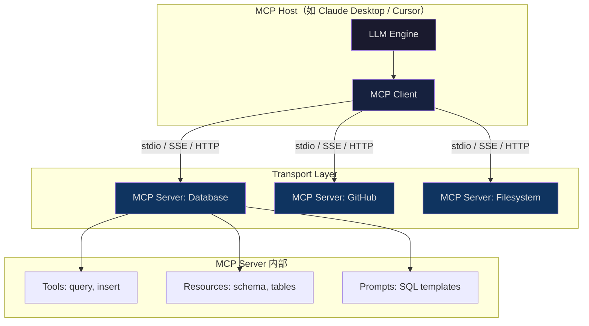

# Module 3: Tools & MCP（工具与 MCP 协议）

> **核心比喻：** 工匠与工具 — Agent 是工匠，工具是专业器具，MCP 是万能适配器（AI 的 USB-C）。

一个没有工具的 Agent 只是个会聊天的模型。工具赋予 Agent **行动能力**——读数据库、调 API、写文件、执行代码。但工具生态的碎片化正在扼杀生产力：每个框架自定义一套 tool schema，每个 LLM 提供商用不同的 function calling 格式。MCP 的出现，就是为了终结这场混乱。

---

## 1. Function Calling 机制：从文本到行动

Function calling 的本质是让 LLM 输出**结构化的函数调用指令**，而非自由文本。三个关键阶段：

### Schema 定义

你向 LLM 注册工具时，提供的是一份 JSON Schema 合约：

```json
{
  "name": "query_database",
  "description": "Execute a read-only SQL query against the production database. Returns up to 100 rows.",
  "parameters": {
    "type": "object",
    "properties": {
      "sql": {
        "type": "string",
        "description": "SELECT statement only. No DDL/DML."
      },
      "database": {
        "type": "string",
        "enum": ["users", "orders", "analytics"]
      }
    },
    "required": ["sql", "database"]
  }
}
```

关键细节：`description` 不是给人看的注释——它是 LLM 决策的**唯一依据**。描述写得烂，工具就会被误用或根本不被调用。后面会专门讲这个坑。

### 参数提取

LLM 从用户自然语言中抽取结构化参数。用户说"查一下上个月的活跃用户数"，模型输出：

```json
{
  "name": "query_database",
  "arguments": {
    "sql": "SELECT COUNT(DISTINCT user_id) FROM events WHERE created_at >= '2026-03-01'",
    "database": "analytics"
  }
}
```

这个过程不是模板匹配，是模型基于 schema 约束做的**受控生成**。OpenAI 称之为 "constrained decoding"，Anthropic 的实现叫 "tool use"——底层都是引导 token 生成符合 JSON Schema 的输出。

### 结果注入

工具执行结果以 `tool_result` 消息注入对话历史，LLM 基于结果继续推理：

```
User → LLM → tool_call(query_database) → Runtime执行 → tool_result → LLM → 最终回答
```

这个循环可以嵌套多轮。一次复杂任务中，Agent 可能连续调用 5-10 个工具，每次结果都追加到上下文窗口中。这也是为什么 Module 1 讲的上下文管理如此关键——工具结果会快速消耗 token 预算。

---

## 2. MCP：标准化层——为什么它重要

### 碎片化现状

2024 年之前的工具生态：

- **OpenAI**：`functions` → `tools`，自有 JSON Schema 变体
- **Anthropic**：`tool_use` block，略不同的 schema 格式
- **LangChain**：`@tool` 装饰器，框架私有抽象
- **各种 Agent 框架**：每家一套 tool definition 格式

结果是：你为 OpenAI 写的工具定义，换到 Claude 要改格式；在 LangChain 里定义的工具，迁移到 CrewAI 要重写适配层。**工具提供方和 LLM 消费方之间没有通用合约。**

### MCP 的定位

Model Context Protocol（MCP）由 Anthropic 于 2024 年 11 月开源，定位是**AI 工具生态的 USB-C 标准**。它解决的核心问题：

- **工具提供方**（数据库、API、文件系统）只需实现一次 MCP Server
- **LLM 客户端**（Claude、Cursor、Windsurf）只需实现一次 MCP Client
- 两端通过标准协议通信，**N×M 问题变成 N+M 问题**

截至 2025 年，MCP TypeScript SDK 月下载量突破 9700 万次。这不是 Anthropic 的单方面推动——OpenAI、Google、微软都已宣布支持或兼容 MCP。它正在成为事实标准。

---

## 3. MCP 架构：客户端-服务端模型



### 核心概念

| 概念 | 角色 | 类比 |
|------|------|------|
| **Host** | 运行 LLM 的应用程序 | 工匠本人 |
| **Client** | Host 内的 MCP 协议客户端，1:1 对应一个 Server | 工匠的手 |
| **Server** | 暴露工具/资源/提示词的独立进程 | 专业工具箱 |
| **Transport** | 通信通道（stdio / HTTP+SSE） | 工具的接口规格 |

### 传输协议

**stdio**：Server 作为子进程启动，通过 stdin/stdout 通信。适合本地工具（文件系统、Git）。零网络开销，最低延迟。

**HTTP + SSE（Streamable HTTP）**：Server 作为独立 HTTP 服务运行。支持远程部署、鉴权、多租户。适合团队共享的 MCP Server（如公司内部数据库访问层）。

### 能力协商

连接建立时，Client 和 Server 通过 `initialize` 握手交换能力：

```json
// Server → Client: 我支持的能力
{
  "capabilities": {
    "tools": { "listChanged": true },
    "resources": { "subscribe": true },
    "prompts": { "listChanged": true }
  }
}
```

这允许 Server 动态声明自己提供哪些功能，Client 按需使用。一个 Server 可以只暴露 Tools（如计算器），也可以同时提供 Resources（如数据库 schema）和 Prompts（如 SQL 模板）。

---

## 4. Pydantic 结构化工具：类型安全的工具定义

在 Python 生态中，最佳实践是用 Pydantic 定义工具参数——类型校验、默认值、文档生成一步到位：

```python
from pydantic import BaseModel, Field
from typing import Literal

class DatabaseQuery(BaseModel):
    """Execute a read-only SQL query. Returns up to max_rows rows as JSON."""

    sql: str = Field(
        description="SELECT statement. DDL/DML will be rejected."
    )
    database: Literal["users", "orders", "analytics"] = Field(
        description="Target database name."
    )
    max_rows: int = Field(
        default=100,
        ge=1,
        le=1000,
        description="Maximum rows to return."
    )
```

Pydantic model 自动生成符合 JSON Schema 的定义，直接喂给 LLM 的 tool registration。好处：

1. **编译时类型检查**：IDE 和 mypy 直接报错
2. **运行时校验**：LLM 输出的参数自动验证，不合规直接拒绝
3. **文档即代码**：docstring 和 Field description 直接变成 LLM 看到的工具描述
4. **序列化内建**：`.model_json_schema()` 直出标准 JSON Schema

在 MCP SDK 中注册工具：

```python
from mcp.server import Server
from mcp.types import Tool

server = Server("db-server")

@server.tool()
async def query_database(params: DatabaseQuery) -> str:
    """Execute a read-only SQL query against the specified database."""
    # 参数已经过 Pydantic 校验，类型安全
    validate_sql_readonly(params.sql)
    result = await db_pool.fetch(params.sql, limit=params.max_rows)
    return json.dumps(result, default=str)
```

---

## 5. Tools vs Skills：原子操作与高层编排

这个区分经常被混淆，但对架构设计至关重要：

| 维度 | Tool（工具） | Skill（技能） |
|------|-------------|--------------|
| 粒度 | 单一原子操作 | 多步骤工作流 |
| 状态 | 无状态 | 可能维护状态 |
| 决策 | 不含业务逻辑 | 包含条件判断和编排逻辑 |
| 示例 | `read_file`、`http_get`、`sql_query` | "部署到生产环境"、"代码审查流程" |
| 类比 | 锤子、锯子、尺子 | "做一把椅子"的完整工艺 |

**Tool** 是 Agent 的原子能力——调一次 API、读一个文件、执行一段 SQL。它应该**幂等、无副作用感知、快速返回**。

**Skill** 是对多个 Tool 调用的**逻辑编排**，通常包含：
- 条件分支（if 测试失败 then 回滚）
- 循环（retry with backoff）
- 状态管理（记住已完成的步骤）
- 错误恢复（fallback 策略）

```python
# Tool: 原子操作
async def run_tests(path: str) -> TestResult: ...
async def git_commit(message: str) -> str: ...
async def deploy(env: str) -> DeployResult: ...

# Skill: 高层编排
async def ship_to_production(feature_branch: str):
    """完整的上线流程——这是 Skill，不是 Tool"""
    test_result = await run_tests("./")
    if not test_result.passed:
        return SkillResult(status="blocked", reason=test_result.failures)

    await git_commit(f"feat: {feature_branch}")

    deploy_result = await deploy("staging")
    if not deploy_result.healthy:
        await deploy("staging", rollback=True)
        return SkillResult(status="failed", reason="staging unhealthy")

    await deploy("production")
    return SkillResult(status="shipped")
```

设计原则：**Tool 尽可能小，Skill 尽可能清晰**。Agent 框架（如 Claude Code 的 slash commands）本质上就是 Skill 层——它们编排多个 Tool 调用来完成复杂任务。

---

## 6. 实战：构建一个 MCP Server

完整的 MCP Server 示例，暴露一个天气查询工具：

```python
# weather_server.py
import json
import httpx
from mcp.server import Server
from mcp.types import Tool
from pydantic import BaseModel, Field

class WeatherQuery(BaseModel):
    """Get current weather for a city."""
    city: str = Field(description="City name, e.g. 'Toronto'")
    units: str = Field(
        default="metric",
        pattern="^(metric|imperial)$",
        description="Temperature units"
    )

app = Server("weather-server")

@app.list_tools()
async def list_tools() -> list[Tool]:
    return [
        Tool(
            name="get_weather",
            description="Get current weather conditions for a city. "
                        "Returns temperature, humidity, and conditions.",
            inputSchema=WeatherQuery.model_json_schema(),
        )
    ]

@app.call_tool()
async def call_tool(name: str, arguments: dict) -> str:
    if name == "get_weather":
        params = WeatherQuery(**arguments)  # Pydantic 校验
        async with httpx.AsyncClient() as client:
            resp = await client.get(
                "https://api.weatherapi.com/v1/current.json",
                params={"q": params.city, "key": WEATHER_API_KEY}
            )
            data = resp.json()
        return json.dumps({
            "city": params.city,
            "temp_c": data["current"]["temp_c"],
            "condition": data["current"]["condition"]["text"],
            "humidity": data["current"]["humidity"],
        })
    raise ValueError(f"Unknown tool: {name}")

if __name__ == "__main__":
    import asyncio
    from mcp.server.stdio import stdio_server

    async def main():
        async with stdio_server() as (read, write):
            await app.run(read, write, app.create_initialization_options())

    asyncio.run(main())
```

在 Claude Desktop 中注册：

```json
// ~/Library/Application Support/Claude/claude_desktop_config.json
{
  "mcpServers": {
    "weather": {
      "command": "python",
      "args": ["weather_server.py"]
    }
  }
}
```

重启 Claude Desktop，你就能自然语言问"多伦多现在天气怎么样"，Agent 自动调用你的 MCP Server。

---

## 7. 常见陷阱与防御

### 陷阱一：糟糕的工具描述

**反模式**：
```json
{ "name": "do_thing", "description": "Does the thing" }
```

LLM 无法判断何时该调用这个工具。**description 是工具的"简历"**——它决定了 LLM 是否选择这个工具、传什么参数。

**正确做法**：
```json
{
  "name": "search_documents",
  "description": "Full-text search across indexed documents. Use when the user asks to find, locate, or search for information in their files. Returns top 10 matches with relevance scores. Does NOT search the web — only local documents."
}
```

要点：说清楚**何时用**、**何时不用**、**返回什么**。

### 陷阱二：工具幻觉（Tool Hallucination）

LLM 有时会"发明"不存在的工具，或对已有工具传入错误参数。典型场景：

- 上下文中有 `search_docs` 工具，LLM 调用了 `search_documents`（名字相近但不存在）
- 参数 schema 要求 `database: enum["users", "orders"]`，LLM 传了 `"products"`

**防御**：
1. Runtime 严格校验——不在注册表中的工具名直接拒绝
2. Pydantic 校验参数——不合规的参数返回清晰错误信息给 LLM
3. 工具名用**明确无歧义**的命名，避免相似名称共存

### 陷阱三：参数校验缺失

```python
# 危险：LLM 可能注入 DROP TABLE
@tool
def query(sql: str):
    return db.execute(sql)

# 安全：显式约束
@tool
def query(params: DatabaseQuery):
    if not params.sql.strip().upper().startswith("SELECT"):
        raise ValueError("Only SELECT statements allowed")
    return db.execute(params.sql, readonly=True)
```

永远假设 LLM 输出的参数**不可信**。它会犯错，会被 prompt injection 利用。每个 Tool 的输入都需要和处理用户输入一样的校验级别。

### 陷阱四：工具数量膨胀

注册 50 个工具给 Agent？LLM 的选择准确率会断崖式下降。经验法则：

- **单次对话 < 20 个工具**：效果最佳
- **20-50 个**：需要精心组织 description，考虑分组
- **50+**：必须引入动态工具加载（按需注册，而非全量暴露）

MCP 天然支持这个模式——每个 Server 暴露少量相关工具，Client 按需连接 Server。

---

## 本模块要点

1. Function calling 是 Agent 行动能力的基础——schema 定义决定 LLM 能否正确使用工具
2. MCP 将工具生态从 N×M 碎片化变成 N+M 标准化，正在成为行业事实标准
3. Client-Server 架构 + 能力协商让工具集成松耦合、可组合
4. Pydantic 是 Python 工具定义的最佳实践——类型安全、自动校验、文档内建
5. Tool 是原子操作，Skill 是高层编排——分清这两层才能设计好 Agent 架构
6. 工具描述是 LLM 决策的唯一依据，写不好就等于没有这个工具
7. 永远不信任 LLM 的工具调用参数——校验、校验、再校验

---

*下一模块：[Module 4: 推理与规划](/modules/module-4-reasoning-and-planning)*
