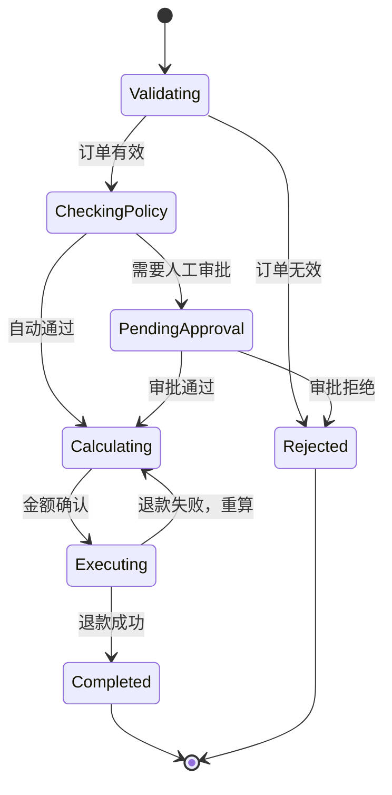

import Image from 'next/image'

# Module 5: Pipeline Orchestrator（管道编排器）

> **核心比喻：** 电影导演 + 制作流水线 — 剧本 → 选角 → 拍摄 → 剪辑 → 上映。单个 Agent 的推理循环是演员的演技，Pipeline Orchestrator 是导演对整部电影的调度。没有导演，再好的演员也拍不出好电影。

## 这章在解决什么问题？

当任务从“问一次答一次”变成“跨多步、可暂停、可能失败、可能回滚”的工作流时，靠隐式消息历史已经不够了。你需要显式状态、显式转换和可恢复的编排骨架。

## 读这一章时，先盯住三件事

- 为什么状态机是复杂 Agent 工作流的骨架，而不是“框架内部细节”
- 顺序管道、事件驱动、图编排各自解决什么问题
- 什么时候该上 Router、Supervisor、Planner-Executor，什么时候根本不该上

## 学完后你应该能做什么

- 为一个多步骤 Agent 任务画出状态和转换，而不是只写一段大 prompt
- 判断一个工作流是否真的需要图编排和持久化恢复
- 用“模式优先”的视角看 LangGraph、CrewAI、AutoGen 等框架差异

## 为什么 Agent 需要显式状态管理？

Module 4 的 ReAct 循环有一个隐含假设：**所有状态都在消息历史里。** 对于简单任务（查天气、算数学），这没问题。但当你的 Agent 工作流变成这样时：

```
用户提交退款申请
  → 验证订单有效性
  → 检查退款政策（可能需要人工审批）
  → 计算退款金额
  → 等待财务确认
  → 执行退款
  → 发送通知
```

纯 ReAct 循环会崩溃。为什么？

1. **中间状态会丢失** — 如果 Agent 在"等待财务确认"时超时重启，消息历史恢复不了"当前处于哪一步"
2. **条件分支不可控** — "人工审批通过"和"人工审批拒绝"走不同路径，ReAct 的自由推理可能走错
3. **并发无法表达** — "同时查询库存和计算运费"在顺序消息流中做不到
4. **可观测性为零** — 生产环境你需要知道：这个请求卡在哪一步？失败率多高？平均耗时多久？

**这就是为什么你需要状态机。** 状态机把隐式的"Agent 觉得该做什么"变成显式的"当前状态 + 允许的转换"。

## 状态机：Agent 工作流的骨架

用电影比喻：状态机就是**拍摄计划表**。每个场景（状态）有明确的入场条件和出场条件，导演不会让演员即兴决定下一场拍什么。

<Image
  src="/course-visuals/module-5/01-refund-workflow-state-machine.svg"
  alt="退款工作流状态机图，展示 Validating、Checking Policy、Pending Approval、Calculating、Executing、Completed 和 Rejected 之间的状态转换。"
  width={1600}
  height={900}
/>

### 最小状态机实现

```python
from enum import Enum
from dataclasses import dataclass, field
from typing import Any, Callable

class RefundState(Enum):
    VALIDATING = "validating"
    CHECKING_POLICY = "checking_policy"
    PENDING_APPROVAL = "pending_approval"
    CALCULATING = "calculating"
    EXECUTING = "executing"
    COMPLETED = "completed"
    REJECTED = "rejected"

@dataclass
class WorkflowContext:
    """工作流运行时的全部状态，可序列化、可恢复"""
    state: RefundState = RefundState.VALIDATING
    order_id: str = ""
    refund_amount: float = 0.0
    approval_required: bool = False
    history: list[dict] = field(default_factory=list)
    error: str | None = None

class StateMachine:
    def __init__(self):
        self.transitions: dict[RefundState, list[tuple[Callable, RefundState]]] = {}

    def add_transition(self, from_state: RefundState, condition: Callable, to_state: RefundState):
        self.transitions.setdefault(from_state, []).append((condition, to_state))

    def next_state(self, ctx: WorkflowContext) -> RefundState:
        for condition, target in self.transitions.get(ctx.state, []):
            if condition(ctx):
                return target
        raise ValueError(f"No valid transition from {ctx.state}")

# 构建状态机
sm = StateMachine()
sm.add_transition(RefundState.VALIDATING, lambda ctx: ctx.order_id != "", RefundState.CHECKING_POLICY)
sm.add_transition(RefundState.CHECKING_POLICY, lambda ctx: ctx.approval_required, RefundState.PENDING_APPROVAL)
sm.add_transition(RefundState.CHECKING_POLICY, lambda ctx: not ctx.approval_required, RefundState.CALCULATING)
sm.add_transition(RefundState.PENDING_APPROVAL, lambda ctx: ctx.error is None, RefundState.CALCULATING)
sm.add_transition(RefundState.PENDING_APPROVAL, lambda ctx: ctx.error is not None, RefundState.REJECTED)
sm.add_transition(RefundState.CALCULATING, lambda ctx: ctx.refund_amount > 0, RefundState.EXECUTING)
sm.add_transition(RefundState.EXECUTING, lambda ctx: True, RefundState.COMPLETED)
```

关键设计点：
- **WorkflowContext 可序列化** — 中断后可以从数据库恢复，继续执行
- **转换条件是纯函数** — 可测试、可审计、不依赖 LLM 的"心情"
- **状态枚举是有限的** — 生产环境你能精确知道系统处于哪个状态

## 状态流转的 Mermaid 图



注意 `Executing → Calculating` 这条回边 — 这就是**循环（cycle）**。图结构天然支持循环，纯顺序管道做不到。

## 事件驱动 vs 顺序管道

两种编排策略，适用场景完全不同。

<Image
  src="/course-visuals/module-5/02-sequential-vs-event-driven-pipeline.svg"
  alt="顺序管道与事件驱动管道对照图，比较线性执行和事件路由在分支、并发和恢复能力上的差异。"
  width={1600}
  height={900}
/>

### 顺序管道（Sequential Pipeline）

```
Input → Step1 → Step2 → Step3 → Output
```

**电影类比：** 流水线式的纪录片制作 — 采访完一个人再采访下一个，剪辑完一段再剪下一段。

**适用场景：**
- ETL 数据处理
- 文档生成流水线（提取 → 摘要 → 翻译 → 排版）
- 确定性流程，不需要条件分支

**优点：** 简单、可预测、容易调试。
**缺点：** 任何一步阻塞，整条线停。无法处理动态决策。

### 事件驱动管道（Event-Driven Pipeline）

```
Event → Router → [Handler1 | Handler2 | Handler3] → Aggregator → Output
```

**电影类比：** 多机位实时直播 — 导播根据现场情况切换镜头，多条线路并行。

**适用场景：**
- 用户交互式工作流（聊天、审批）
- 需要并发的任务（同时搜索多个数据源）
- 长时间运行、需要中间暂停的流程

**优点：** 灵活、可并发、支持中断恢复。
**缺点：** 复杂度高、调试困难、需要消息队列基础设施。

### 选择标准

| 维度 | 顺序管道 | 事件驱动 |
|------|---------|---------|
| 步骤数 | < 5 | > 5 或不确定 |
| 是否有条件分支 | 无 | 有 |
| 是否需要并发 | 不需要 | 需要 |
| 是否需要人工介入 | 不需要 | 可能需要 |
| 失败恢复 | 从头重跑 | 从断点恢复 |

## 三种运行时编排模式

这是本模块的核心。所有 Agent 编排框架，剥去 API 差异，底层都是这三种模式的组合。

<Image
  src="/course-visuals/module-5/03-router-supervisor-planner-board.png"
  alt="三种运行时编排模式对照图，比较 Router、Supervisor 和 Planner-Executor 的决策结构与适用任务。"
  width={1920}
  height={1080}
/>

### 1. Router（路由器）

```
Input → Router → [Agent A | Agent B | Agent C] → Output
```

**电影类比：** 选角导演 — 看到剧本，决定这场戏由谁来演。

**工作原理：** 一个分发节点根据输入特征，把任务路由到最合适的处理者。Router 本身不处理任务。

```python
def router(task: dict) -> str:
    """根据任务类型路由到对应 Agent"""
    task_type = classify(task["query"])  # LLM 或规则分类
    return {
        "code": "code_agent",
        "data": "data_agent",
        "writing": "writing_agent",
    }.get(task_type, "general_agent")
```

**适用场景：** 多技能 Agent 系统、客服分流、意图识别后分派。

### 2. Supervisor（监督者）

```
Supervisor ⇄ [Agent A, Agent B, Agent C]
     ↓
  决定下一步由谁执行
```

**电影类比：** 现场导演 — 不亲自演，但每拍完一条都要看回放，决定是重拍、继续、还是换方案。

**工作原理：** Supervisor 是一个持续运行的决策者，它观察子 Agent 的输出，决定下一步行动。和 Router 的区别：Router 只分发一次，Supervisor 持续监控和调度。

```python
def supervisor_loop(task: str, agents: dict, max_rounds: int = 10):
    context = {"task": task, "results": []}

    for _ in range(max_rounds):
        # Supervisor 决定下一步
        decision = llm.chat([{
            "role": "system",
            "content": f"可用 Agent: {list(agents.keys())}。根据当前进度决定下一步。回复 'DONE' 表示完成。"
        }, {
            "role": "user",
            "content": f"任务: {task}\n当前结果: {context['results']}"
        }])

        if "DONE" in decision:
            return context["results"]

        agent_name = parse_agent_choice(decision)
        result = agents[agent_name].run(context)
        context["results"].append({"agent": agent_name, "result": result})
```

**适用场景：** 复杂任务需要多个专家协作、需要动态调整策略、质量要求高需要审核环节。

### 3. Planner-Executor（规划-执行）

```
Planner → [Plan Step 1, Step 2, Step 3]
             ↓
Executor → 执行 Step 1 → 结果 → Planner 评估 → 继续/修改计划
```

**电影类比：** 编剧 + 导演的分工 — 编剧写好分场剧本，导演逐场拍摄。如果某场戏效果不好，编剧改剧本，导演重拍。

**工作原理：** 把"想"和"做"分离。Planner 负责高层策略，Executor 负责具体执行。执行结果反馈给 Planner，Planner 决定是否需要修改计划。

**适用场景：** 长链任务（研究报告、代码重构）、需要全局视角的任务、执行代价高需要提前规划的场景。

## 图编排：节点、边、条件路由和循环

图（Graph）是目前最强大的 Agent 编排抽象。LangGraph 把它做成了核心范式，但这个思想不依赖任何框架。

### 为什么是图？

因为真实的 Agent 工作流**不是线性的**。它有：
- **条件分支** — 根据中间结果走不同路径
- **循环** — 失败重试、迭代优化
- **并行** — 同时执行多个独立步骤
- **汇聚** — 多个并行步骤完成后合并结果

这些特性，只有图结构能自然表达。

### 图编排的核心概念

```python
# 伪代码：图编排的最小抽象
class Node:
    """图中的一个处理节点"""
    def __init__(self, name: str, fn: Callable):
        self.name = name
        self.fn = fn  # 接收 state，返回 state 的修改

class Edge:
    """节点之间的连接"""
    def __init__(self, source: str, target: str, condition: Callable | None = None):
        self.source = source
        self.target = target
        self.condition = condition  # None = 无条件转换

class Graph:
    def __init__(self):
        self.nodes: dict[str, Node] = {}
        self.edges: list[Edge] = []

    def run(self, state: dict, entry: str) -> dict:
        current = entry
        while current != "END":
            # 执行当前节点
            state = self.nodes[current].fn(state)
            # 找到下一个节点
            current = self._next(current, state)
        return state

    def _next(self, current: str, state: dict) -> str:
        for edge in self.edges:
            if edge.source == current:
                if edge.condition is None or edge.condition(state):
                    return edge.target
        return "END"
```

**四个关键操作：**

| 操作 | 含义 | 电影类比 |
|------|------|---------|
| **Node** | 处理步骤 | 一场戏 |
| **Edge** | 无条件转换 | 剧本的场次顺序 |
| **Conditional Edge** | 条件转换 | 导演说"如果这条 OK 就拍下一场，不 OK 就重拍" |
| **Cycle** | 回边/循环 | 反复打磨一场重头戏直到满意 |

## 框架的编排模式对照

不教 API，教模式。以下四个框架代表了四种不同的编排哲学：

### LangGraph — 显式图定义

**核心理念：** 状态机 + 图 = 可控的 Agent 编排。开发者显式定义每个节点和边。

**编排模式：** 图优先。你画好图，框架按图执行。适合需要精确控制流程的场景。

**设计哲学：** "Agent 的每一步都应该是可预测、可调试、可中断的。"

**典型用法：** 条件路由、human-in-the-loop、长时间运行的工作流。

### CrewAI — 角色扮演协作

**核心理念：** 定义角色（Agent）+ 任务（Task）+ 流程（Process），框架协调执行。

**编排模式：** 任务图。你定义任务之间的依赖关系，框架决定执行顺序。

**设计哲学：** "像组建一个团队，给每个人明确的角色和职责。"

**典型用法：** 内容生成流水线、研究报告、多步骤分析。

### AutoGen — 对话驱动

**核心理念：** Agent 之间通过消息对话来协作，像一个群聊。

**编排模式：** 消息传递。没有显式的图，Agent 之间的交互由对话驱动。

**设计哲学：** "让 Agent 像人一样沟通，自然涌现协作模式。"

**典型用法：** 代码生成+审查、头脑风暴、需要反复讨论的任务。

### LlamaIndex Workflows — 事件驱动

**核心理念：** 基于事件的异步工作流，步骤之间通过事件连接。

**编排模式：** 事件流。每个步骤发射事件，订阅了该事件的步骤自动触发。

**设计哲学：** "数据流动驱动执行，不需要中央调度器。"

**典型用法：** RAG 管道、数据处理流水线、需要细粒度控制的检索工作流。

### 模式对照表

| 维度 | LangGraph | CrewAI | AutoGen | LlamaIndex Workflows |
|------|-----------|--------|---------|---------------------|
| 核心抽象 | 图 + 状态 | 角色 + 任务 | Agent + 消息 | 步骤 + 事件 |
| 控制粒度 | 最细（节点级） | 中等（任务级） | 最粗（对话级） | 细（事件级） |
| 学习曲线 | 陡 | 平缓 | 中等 | 中等 |
| 适合场景 | 复杂条件工作流 | 团队协作模拟 | 对话式协作 | 数据处理管道 |
| 状态管理 | 内置、可持久化 | 隐式 | 消息历史 | 上下文对象 |
| Human-in-the-loop | 原生支持 | 有限 | 通过消息 | 通过事件 |

## 选择决策框架

当你面对一个新的 Agent 工作流需求时，按以下顺序决策：

```
Q1: 流程是否确定（步骤固定、无条件分支）？
  → Yes: 顺序管道。写个 for 循环就行，不需要框架。
  → No: 继续 Q2

Q2: 是否需要多个 Agent 角色协作？
  → No: 单 Agent + 状态机。用 Router 或 Planner-Executor。
  → Yes: 继续 Q3

Q3: Agent 之间的交互模式？
  → 固定流程、明确分工 → Supervisor 模式（CrewAI 风格）
  → 需要反复讨论、迭代 → 对话模式（AutoGen 风格）
  → 复杂条件路由、需要持久化 → 图模式（LangGraph 风格）

Q4: 是否需要 human-in-the-loop？
  → Yes: 必须有状态持久化。优先图模式。
  → No: 根据 Q3 选择。

Q5: 是否是生产环境？
  → Yes: 需要可观测性、错误恢复、状态持久化。图模式或事件驱动。
  → No: 原型阶段，用最简单的方式快速验证。
```

**一条黄金法则：** 能用顺序管道解决的，不要用图。能用单 Agent 解决的，不要用多 Agent。复杂度是成本，不是功能。

## 从导演视角看全局

回到电影比喻做个总结：

| 电影制作 | Agent 编排 | 对应概念 |
|---------|-----------|---------|
| 剧本 | 任务定义 + 状态机 | State Machine, Workflow Definition |
| 选角 | Agent/Tool 选择 | Router, Tool Selection |
| 拍摄 | 执行节点 | Node Execution, Agent Run |
| 剪辑 | 结果聚合 + 条件路由 | Aggregation, Conditional Routing |
| 上映 | 输出 + 监控 | Output, Observability |

导演的价值不在于亲自演戏，而在于**让对的人在对的时间做对的事**。Pipeline Orchestrator 的价值也一样 — 它不处理具体任务，它确保整个工作流按预期运转。

**关键认知：** 编排模式是永恒的（Router、Supervisor、Planner-Executor、Graph），框架是短暂的。掌握模式，框架随便换。

## 参考项目

- **LangGraph** — 图编排的标杆实现，深入理解状态机 + 图的结合
- **CrewAI** — 角色驱动编排的代表，适合理解任务分解和团队协作模式

## 实战检查表

- [ ] 在上框架前，先把状态、转换条件和终止条件画清楚了
- [ ] WorkflowContext 可序列化、可恢复、可审计，而不是只活在内存里
- [ ] 条件分支写成显式转换，不把关键业务决策完全交给 LLM 自由发挥
- [ ] 只有真的需要并发、等待、人工介入时，才选择事件驱动或图编排

---

*下一模块：[Module 6: Multi-Agent Systems](/modules/module-6-multi-agent-systems) — 从单导演到制片厂，多 Agent 系统的架构与协调*
