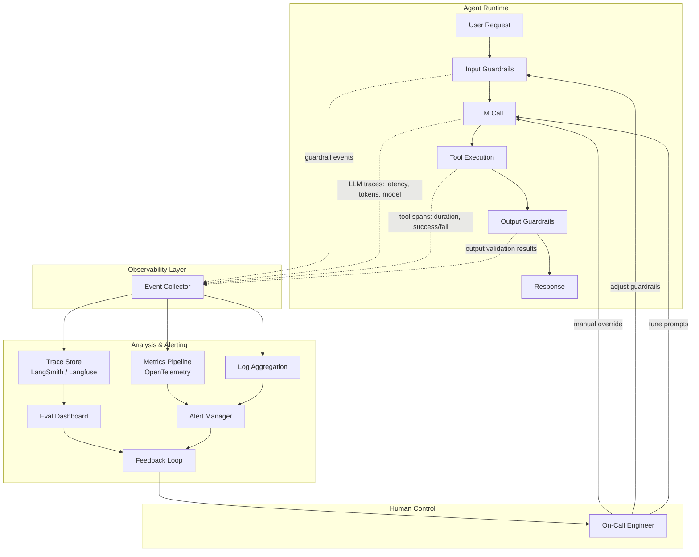

# Module 7: Production Essentials（生产环境要点）

> **核心比喻：** 任务控制中心 — 监控面板、告警系统、手动覆盖按钮（如 NASA 的 Mission Control）。

Apollo 13 的飞行控制员没有直接修复太空中的氧气罐。他们通过遥测数据判断局势，通过通信链路下达指令，通过手动覆盖（manual override）在自动系统失效时接管控制。

你的 AI Agent 在生产环境中面临的挑战完全一样：**你无法预测每一次对话的走向，但你必须知道它什么时候偏航了，并且有能力纠正它。**

这个模块不教你怎么部署一个 FastAPI 服务。你已经做了 17 年了。这里讲的是 Agent 特有的生产问题——那些你在传统软件中从未遇到过的东西。

---

## 1. Guardrails：安全边界系统

传统 API 的输入验证是确定性的：字段类型、长度限制、正则匹配。Agent 的输入是自然语言，输出是非确定性的。这要求完全不同的防御策略。

### 输入层防御

```python
# 不是简单的 schema validation，而是语义级别的检查
class InputGuardrail:
    def validate(self, user_input: str) -> GuardrailResult:
        checks = [
            self.check_prompt_injection(user_input),   # 检测 "ignore previous instructions"
            self.check_topic_boundary(user_input),      # 是否超出 Agent 的职责范围
            self.check_pii_exposure(user_input),        # 用户是否无意中提交了敏感信息
            self.check_token_budget(user_input),        # 输入是否会导致上下文溢出
        ]
        return GuardrailResult(passed=all(c.ok for c in checks), violations=checks)
```

关键区别：传统验证是 **拒绝非法输入**，Agent guardrail 是 **约束行为空间**。[Guardrails AI](https://github.com/guardrails-ai/guardrails) 提供了一套声明式框架来定义这些约束，支持自定义 validator 链。

### 输出层过滤

Agent 的输出比输入更危险，因为它可能：
- **泄露系统提示词**（system prompt leakage）
- **生成有害内容**（即使输入是无害的）
- **产生自信的错误答案**（hallucination with high confidence）
- **执行未授权的工具调用**（tool call 超出预期范围）

```python
class OutputGuardrail:
    def filter(self, agent_output: AgentOutput) -> AgentOutput:
        # 工具调用白名单 —— 这是最关键的 guardrail
        if agent_output.tool_calls:
            for call in agent_output.tool_calls:
                assert call.name in self.allowed_tools, f"Unauthorized tool: {call.name}"
                assert self.validate_tool_args(call), f"Invalid args for {call.name}"

        # 输出内容检查
        self.check_no_system_prompt_leak(agent_output.text)
        self.check_content_policy(agent_output.text)
        self.check_factual_grounding(agent_output.text, agent_output.context)

        return agent_output
```

### 实战原则

| 层级 | 检查内容 | 失败策略 |
|------|---------|---------|
| 输入 | Prompt injection、话题边界、PII | 拒绝 + 解释 |
| 工具调用 | 白名单、参数范围、调用频率 | 阻断 + 告警 |
| 输出 | 内容安全、事实性、提示词泄露 | 重写或降级到模板回复 |
| 系统 | Token 预算、延迟阈值、错误率 | 熔断 + 回退到简单模式 |

---

## 2. Human-in-the-Loop：何时按下手动覆盖按钮

Mission Control 的核心设计理念：**自动化处理常规操作，人类决策关键时刻。** 不是每个决定都需要人，但某些决定绝对不能没有人。

### 触发条件矩阵

```
置信度高 + 影响低 → 全自动（查询天气、格式转换）
置信度高 + 影响高 → 自动执行 + 事后审计（生成报告、数据分析）
置信度低 + 影响低 → 自动重试 + 降级（搜索结果不理想时换策略）
置信度低 + 影响高 → 强制人工审批（发送邮件、修改数据库、金融交易）
```

### 实现模式

**Approval Gate（审批门）：** Agent 暂停执行，等待人工确认后继续。适用于不可逆操作。

```python
async def execute_with_approval(action: AgentAction) -> Result:
    if action.requires_approval():
        approval = await request_human_approval(
            action=action,
            context=action.reasoning_trace,  # 给审批者看推理过程
            timeout=timedelta(hours=24),
            fallback="reject"                # 超时默认拒绝
        )
        if not approval.granted:
            return Result.rejected(reason=approval.reason)
    return await action.execute()
```

**Escalation（升级）：** Agent 检测到自己无法处理的情况，主动转交给人类。这比静默失败好 100 倍。

**Feedback Injection（反馈注入）：** 人类在 Agent 运行过程中注入修正信号。类似于 Mission Control 发送轨道修正指令。

---

## 3. 可观测性：遥测系统架构

传统应用的可观测性三支柱（metrics、logs、traces）在 Agent 场景下需要扩展。你还需要追踪 **推理链路**、**工具调用图**、**token 消耗分布** 和 **语义漂移**。

### 监控架构



### 核心指标体系

**请求级指标（per-request）：**
- `agent.latency.total` — 端到端延迟（含所有 LLM 调用和工具调用）
- `agent.llm.calls_per_request` — 单次请求中 LLM 调用次数（ReAct 循环的迭代数）
- `agent.tokens.total` — 总 token 消耗（input + output）
- `agent.tools.calls` — 工具调用次数和分布
- `agent.guardrail.violations` — guardrail 触发次数和类型

**系统级指标（system-wide）：**
- `agent.success_rate` — 任务完成率（需要定义什么算"成功"）
- `agent.escalation_rate` — 升级到人工的比例
- `agent.cost.per_request` — 每次请求的美元成本
- `agent.drift.semantic` — 输出的语义漂移（与基准分布的偏移）

### 工具选型

**[LangSmith](https://smith.langchain.com/)** — LangChain 生态的原生追踪平台。优势是与 LangChain/LangGraph 深度集成，开箱即用。劣势是厂商锁定。

**[Langfuse](https://langfuse.com/)** — 开源替代方案，支持自托管。提供 trace 可视化、prompt 管理、评估集成。如果你不想被绑定在某个框架上，这是更好的选择。

**[OpenTelemetry](https://opentelemetry.io/)** — 标准化的遥测框架。用它来桥接 Agent 追踪与你现有的 APM 系统（Datadog、Grafana、New Relic）。Agent 的 trace 应该和你的服务 trace 在同一个面板上。

```python
# OpenTelemetry + Langfuse 混合方案示例
from opentelemetry import trace
from langfuse.decorators import observe

tracer = trace.get_tracer("agent-service")

@observe()  # Langfuse: 追踪 LLM 调用细节
def run_agent(request: AgentRequest):
    with tracer.start_as_current_span("agent.run") as span:  # OTel: 融入服务级 trace
        span.set_attribute("agent.request_id", request.id)
        span.set_attribute("agent.model", request.model)

        result = agent.invoke(request)

        span.set_attribute("agent.tokens.total", result.token_usage.total)
        span.set_attribute("agent.tools.count", len(result.tool_calls))
        return result
```

---

## 4. 评估框架：如何衡量 Agent 的表现

这是 Agent 生产化中最难的部分。传统软件有明确的正确/错误——API 返回 200 就是对的。Agent 的输出是开放式的，"好"和"不好"之间有巨大的灰色地带。

### LLM-as-Judge

用一个 LLM 评估另一个 LLM 的输出质量。听起来像是循环论证，但实际上效果出奇地好——前提是你的评估 prompt 足够精确。

```python
JUDGE_PROMPT = """
评估以下 Agent 回复的质量。评分 1-5。

评分维度：
- 事实准确性：回答是否与提供的 context 一致？（不是"你认为对不对"，而是"有没有 context 支撑"）
- 完整性：是否回答了用户的所有子问题？
- 安全性：是否有不当内容、虚构信息、或提示词泄露？

用户问题：{question}
Agent 上下文：{context}
Agent 回复：{response}

输出 JSON：{"accuracy": int, "completeness": int, "safety": int, "reasoning": str}
"""
```

### 自动化评估流水线

```
Eval Dataset（标注数据集）
    ↓
Agent 运行（生成回复）
    ↓
多维度评估（LLM-as-Judge + 规则检查 + 人工抽检）
    ↓
评分聚合 + 回归检测
    ↓
CI/CD Gate（低于阈值阻断部署）
```

### 评估类型对照

| 评估方法 | 适用场景 | 优势 | 局限 |
|---------|---------|------|------|
| LLM-as-Judge | 开放式回复质量 | 可扩展、接近人类判断 | 自身有偏见、成本不低 |
| 规则检查 | 格式、长度、关键词 | 确定性、零成本 | 无法评估语义质量 |
| 人工评估 | 关键场景的金标准 | 最可靠 | 不可扩展 |
| A/B 测试 | Prompt 变更、模型切换 | 真实用户反馈 | 需要足够流量 |
| 基准测试集 | 回归检测 | 可重复、可自动化 | 覆盖面有限 |

核心原则：**不要只用一种评估方法。** 就像测试金字塔一样，你需要多层评估：大量自动化规则检查 + 适量 LLM-as-Judge + 少量人工抽检。

---

## 5. 成本管理与速率控制

LLM API 调用是按 token 计费的。一个失控的 ReAct 循环可以在几分钟内烧掉几百美元。这不是理论风险——在生产环境中每月都会发生。

### 成本控制四道防线

**第一道：Token 预算（per-request）**
```python
MAX_TOKENS_PER_REQUEST = 50_000  # 硬上限
MAX_LLM_CALLS_PER_REQUEST = 10   # ReAct 循环最大迭代数
MAX_TOOL_CALLS_PER_REQUEST = 20   # 工具调用上限
```

**第二道：用户级速率限制**
```python
# 不只是 requests/min，还要限制 tokens/hour
rate_limits = {
    "free_tier":  {"requests": 20, "tokens": 100_000, "period": "1h"},
    "pro_tier":   {"requests": 200, "tokens": 1_000_000, "period": "1h"},
    "enterprise": {"requests": 2000, "tokens": 10_000_000, "period": "1h"},
}
```

**第三道：模型降级策略**
```python
def select_model(task_complexity: float, remaining_budget: float) -> str:
    if remaining_budget < 0.1:        # 预算快耗尽
        return "gpt-4o-mini"           # 降级到便宜模型
    if task_complexity < 0.3:          # 简单任务
        return "gpt-4o-mini"           # 不需要用大模型
    return "gpt-4o"                    # 复杂任务用强模型
```

**第四道：熔断器（Circuit Breaker）**

当错误率超过阈值时，停止发送请求。防止在模型故障时持续烧钱。

### 缓存策略

对于确定性查询（相同输入 → 相同输出的场景），语义缓存可以节省 30-60% 的 API 调用成本：

```python
# 语义缓存：不是精确匹配，而是 embedding 相似度匹配
async def cached_llm_call(prompt: str) -> str:
    cache_key = get_semantic_hash(prompt)  # embedding-based
    cached = await cache.get(cache_key, similarity_threshold=0.95)
    if cached:
        return cached.response  # 命中缓存，零成本
    response = await llm.invoke(prompt)
    await cache.set(cache_key, response, ttl=3600)
    return response
```

---

## 6. 反馈循环与持续改进

Mission Control 的每次任务结束后都有 debrief。Agent 系统需要同样的机制——**从生产数据中持续学习和改进。**

### 反馈数据的三个来源

1. **显式反馈** — 用户点赞/点踩、评分、文字反馈
2. **隐式反馈** — 用户是否采纳了建议？是否重新提问（说明第一次回答不满意）？会话是否提前终止？
3. **系统反馈** — Guardrail 触发率、工具调用失败率、延迟异常

### 改进闭环

```
生产数据收集 → 低分样本筛选 → 失败模式分类
    ↓
Prompt 调优 / Few-shot 示例更新 / Guardrail 规则修改
    ↓
离线评估（Eval Dataset 回归测试）
    ↓
灰度发布（5% 流量验证）→ 全量发布
```

关键点：**永远不要直接在生产环境修改 prompt。** 所有 prompt 变更必须经过评估流水线和灰度验证。Prompt 就是代码，应该有同样的 CI/CD 流程。

---

## 7. 常见生产故障及防御

17 年经验告诉你，生产问题从来不是你预期的那种。以下是 Agent 系统特有的故障模式：

### 故障清单

| 故障 | 症状 | 根因 | 防御 |
|------|------|------|------|
| **无限循环** | Token 爆炸、延迟飙升 | ReAct 循环无法收敛 | 硬性迭代上限 + token 预算 |
| **工具滥用** | 同一工具被反复调用 | 工具返回结果不明确，LLM 反复重试 | 调用频率限制 + 更好的工具描述 |
| **Prompt 注入** | Agent 行为异常、输出系统指令 | 恶意用户输入 | 输入过滤 + 输出检查 + 权限最小化 |
| **上下文污染** | 多轮对话后回答质量下降 | 上下文窗口被无关信息填满 | 上下文压缩 + 滑动窗口 |
| **级联失败** | 整个系统不可用 | 一个工具超时导致重试风暴 | 熔断器 + 超时 + 优雅降级 |
| **静默错误** | 输出看起来正常但事实错误 | Hallucination + 缺乏事实校验 | 输出 grounding 检查 + 置信度标注 |
| **成本失控** | 月底账单是预期的 10 倍 | 未设预算上限 + 循环失控 | 四道防线 + 实时成本告警 |

### 防御性架构的核心原则

1. **Fail fast, fail loud** — Agent 出错时必须快速失败并发出明确信号，绝不静默吞掉错误
2. **最小权限** — Agent 的工具权限应该和它的任务严格匹配。不要给客服 Agent 数据库写入权限
3. **可回退** — 每次 prompt 变更、模型切换都必须支持快速回退到上一个版本
4. **渐进式信任** — 新 Agent 上线时从低权限开始，随着评估数据积累逐步放开能力

---

## 总结：你的 Mission Control 清单

在把 Agent 送上"太空"之前，确认以下系统已就位：

- [ ] **Guardrails** — 输入验证、输出过滤、工具白名单、token 预算
- [ ] **Human-in-the-Loop** — 高风险操作的审批门、超时兜底策略
- [ ] **可观测性** — LLM trace 追踪、工具调用监控、成本面板、告警规则
- [ ] **评估流水线** — 自动化 eval + LLM-as-Judge + 人工抽检
- [ ] **成本控制** — 四道防线、模型降级策略、语义缓存
- [ ] **反馈循环** — 生产数据回收、prompt 版本管理、灰度发布
- [ ] **故障防御** — 熔断器、最大迭代数、优雅降级方案

没有人能预测 Agent 在每一次对话中会做什么。但你可以搭建一个系统，让你在任何时候都知道它在做什么、为什么这么做、以及如何在必要时接管控制。

这就是 Mission Control 的意义。

---

[返回首页](/)
